# TensorFlow Bijectors
- In this project, I explored how to use TensorFlow Probability Bijectors to transform distributions and perform operations on them.
- You can get the code in [tensorflow_bijectors.ipynb](./tensorflow_bijectors.ipynb)

## Bijector Basics
- We started with basic bijectors like `Exp` and `Affine`. Bijectors allow transforming base distributions such as a standard normal distribution into more complex ones by applying mathematical transformations.

- Sampling from the distribution before applying bijectors.

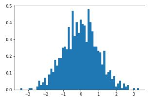

- Sampling from the distribution after applying `Shift` and `Scale` bijectors. (notice the axis values)

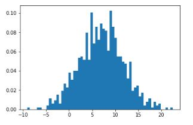

- Using `Softfloor` bijector:

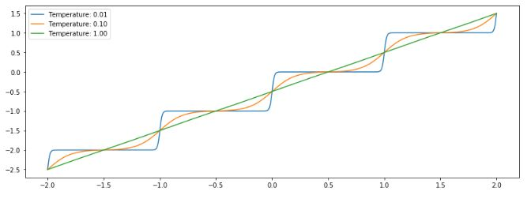

- Using `GumbelCDF` bijector:

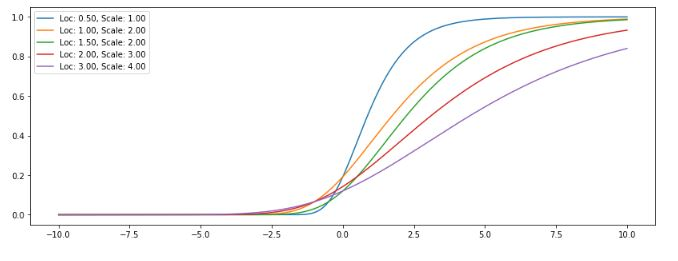

### Exponential Bijector:
- Used an exponential bijector to transform the distribution.

- Transformation applied to a normal distribution to stretch it exponentially.

### Example of a Cubic Bijector:
- This example applies a cubic transformation to a normal distribution.

- Forward transformation using the cubic bijector.

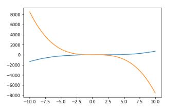

- The determinant of the forward transformation.

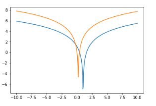

- The inverse transformation.

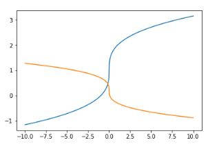

- The determinant of the inverse transformation.

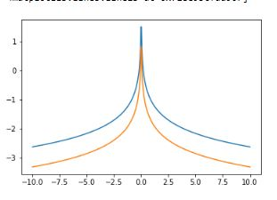

### Normalizing Flow with Mixtures:
- Demonstrated how to train a normalizing flow model with a Gaussian mixture model.

- Visualization of a mixture of Gaussians before training.

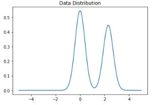

- The Gaussian mixture before training the model.

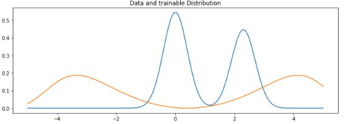

### Training and Evaluation:
- Trained the bijector model and visualized its results.

- The training process for the bijector model.

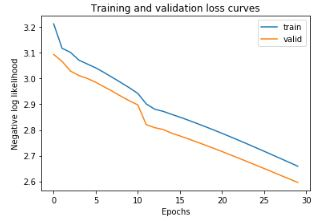

### Sampling and Data Transformation:
- Showcased sampling and transformation of distributions using trained bijectors.

- Comparison of normal and masked distributions.

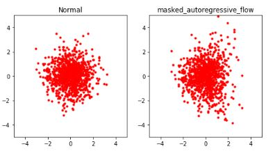

- The sample after applying normalization.

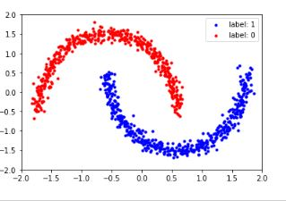

### Masked and Permuted Distributions:
- Demonstrated how masked and permuted bijectors modify distributions.

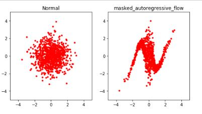
- Masked distribution after training.

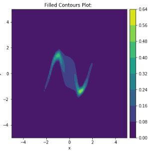
- Contour plot of the masked distribution.

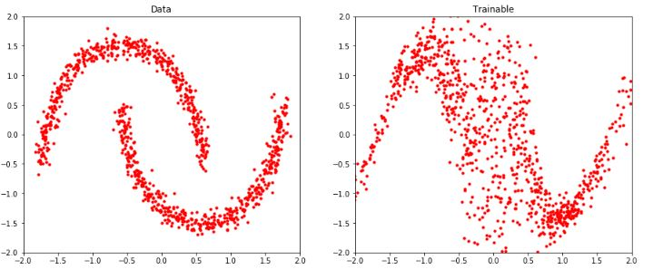
- Data points of the masked distribution.

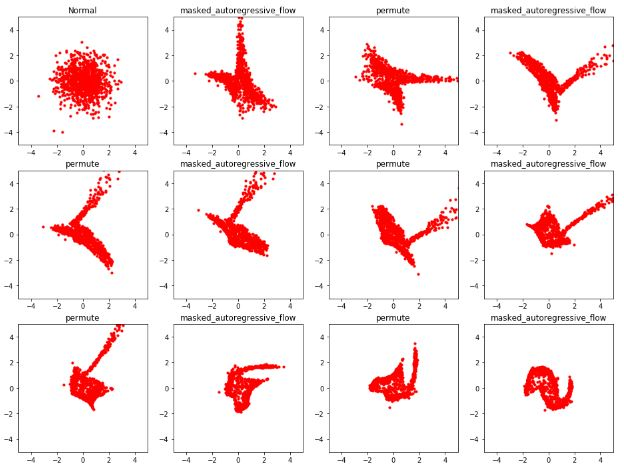
- Permuted distribution after training.

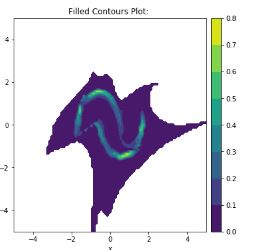
- Contour plot of the permuted distribution.

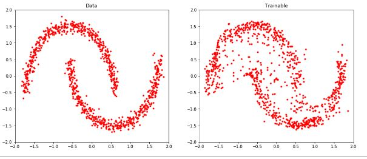
- Data points of the permuted distribution.

## Setup
- Create virtual environment: `python -m venv venv`
- Activate virtual environment: `call venv/Scripts/activate.bat` in cmd
- Install dependencies: `pip install -r requirements.txt`

# Libraries
- TensorFlow
- TensorFlow Probability
- Matplotlib

## Contact
- LinkedIn: [Natan Asrat](https://linkedin.com/in/natan-asrat)
- Gmail: nathanyilmaasrat@gmail.com
- Telegram: [Natan Asrat](https://t.me/fail_your_way_to_success)
- Youtube: [Natville](https://www.youtube.com/@natvilletutor)
